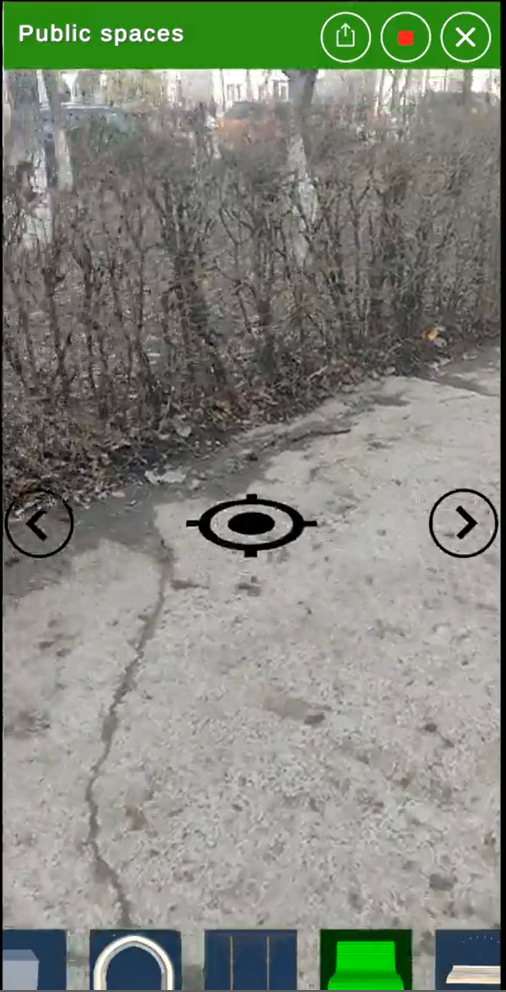
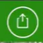
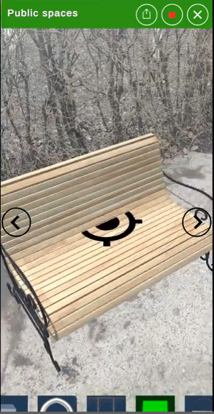
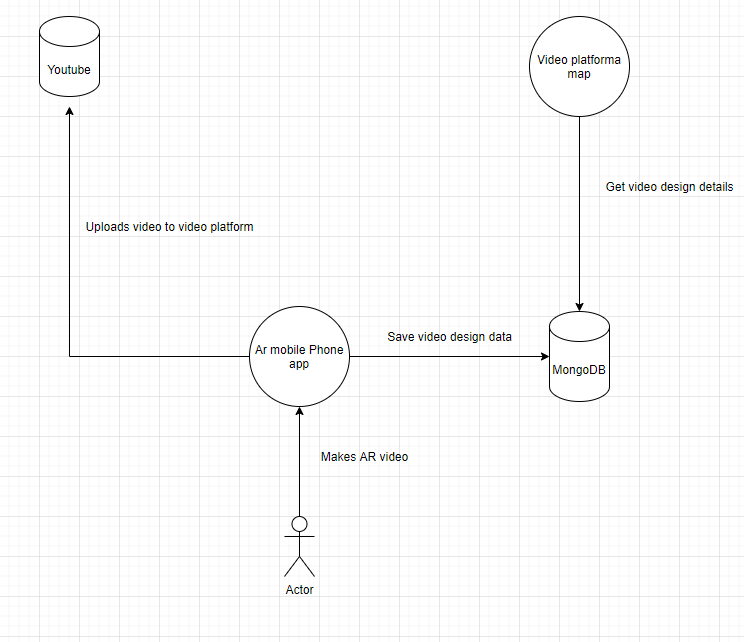

# Design AR 

## Concept

Design AR is an application that showcases the posibility of enriching reallife landscapes with additional information and objects using AR. The enriched landspace is then filmed and uploaded to a video platform where people can like or share their favorite creations. The video platform will have a filtering functionality so people can see the most rated videos and staff from the municipalities use those as inspiration for future projects.

## Functional Considerations

From a functional perspective our solution has 2 components 
- The mobile application
- The video platform

### The AR mobile application

The mobile application has the following structure:

Once you opened the application the player camera will open and you will see the following screen
 

The screen is divided in 3 parts, the top part has 3 buttons the player can press
The main menu (If a player presses this button a menu will appear showcasing a list of options)

The record button a player can press to start recording and press again to stop recording 

The exit button that will close the application

The middle part is the video input + 2 arrows to rotate the objects that is placed on the ground + an indicator that once it appears and you press on it an object will be placed on that location

 

The bottom part where a scrollable bar with all the objects you can place is present. You can scroll right or left to select the object you would like to place. The selected object will be highlighted.

Once the video recording is stopped a video will be saved locally on the players phone. An option should be added for the player to view his videos and to upload them on the video platform.

### The video platform

Currently this is not implemented. We have in place an website with a map showcasing the position from where the videos were recording and displaying them on the map. We could expand this website functionality and transform it into a video platform with this feature to see only the videos from a certain region, or to view them on an map but this has to be designed.

#### Things we need to do regarding functional analysis

- We have to make a design documentation showcasing each step of the application and how you can get from 1 step to another
- We have to come up with a Centric design that complies with Centric applications
- We have to decide if the current layout is intuitive enough or if we want to use a different one
- We have to decide how the upload and the view videos screen look like
- In order for each person to use this app and upload videos from this app we will have to have authentication so each user will have his own account (this has to be discussed because is expensive)
- We have to design the video platform and how it will look like
- We also have to decide where do we get the models we want to use, do we use the existent ones?

## Development Considerations

Regarding the development considerations the current solutions is comprised from 2 different solutions 

1. The mobile AR app that is written in C# using Unity3D software
2. The web application that is using AngularJs and bootstrap. The web application is hosted in Azure. 

 

### The mobile AR ap

If we want multiple people working on this we have to make sure the unity project code is available for everybody inside Centric Labs to use. This means that we have to upload the code to git and make sure everybody has access to it. Unity projects are quite big in this case 5 GB because it includes also the models we are using to display which are stock models from the internet. We also have to clean the project and remove some exiting code that will not help with the final mobile product.

The mobile application right now has the following components :
- The AR component (Works on Android 9+)
- The record screen component (Has to be replaced since it's only working on Android 10)
- The database component (Has to be replaced since we are using mongodb free database with 500MB available)
- The video upload component (Has to be replaced, since we are using youtube api linked to my personal account)
- The location component

In order to bring this to production we have to replace the components above.

### The web application

Currently we have an AngularJS app using google maps component to display the map and the markers with the videos on it. We are using 2 google maps components one for the map and one for filtering.

Those componenets are paid componenets
- The map is free only if there are under 10.000 requests 
- The filtering componenet also is paid after a number of requsts

The app is making a call to our backed which is hosted in azure (the same as the client app). The backend has a connection to the same free tier mongo db database (500MB).

We will have to do the following:

- Replace the database to a production ready one and replace the backend code for calling it
- Enhance the ui and based on the design create additional screens to view, like, share the videos
- Add authentification service
- Add rules and restrictions to make sure we don't violate any privacy with this platform since we are recording the location from where the videos were took

## Costs

The app is completely free but we have to take into consideration the maintaince costs. If we are to launch this app on the google store for android only (right now we don't support IOS for the AR component), we have to take into consideration the google developer account to upload which is payed. Once the app is live and is in the store, people can download it, make accounts and start making videos and upload them onto our video platform. The video platform has to be hosted, also the database has to be hosted (so here are the main costs), if we can upload videos the database can become quite big really fast.

The google services are payed so we have to keep that in mind also. In conclusion the maintainance costs are the following :

- Client + backend hosting
- Database hosting
- Google maps api prices
- Video platform maintance costs
- Google developer account costs
- Unity tool costs (in order to don't have the unity logo we have to use the paid unity version)

